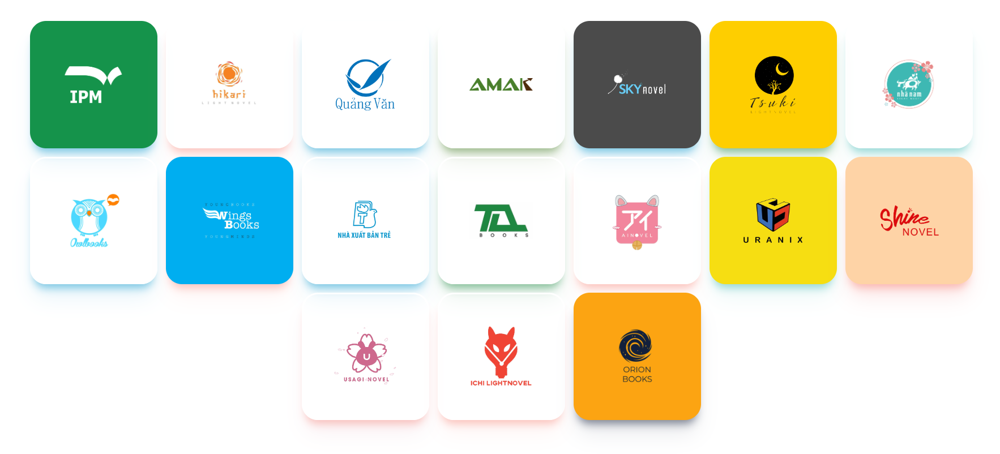

  

<h2 align="center"> Vietnam Light Novel Ranking </h2>

<h4 align="center"> A modern voting platform with a clean yet expressive design. </h4>

##

## About Ranking

In the Vietnamese Light Novel reader community, the **Vietnamese Light Novel Ranking** shines as a spiritual destination, where passionate souls of Japanese literature gather, share their passion, and discover the most popular works. This journey is not just a vote, but also an adventure, a journey of cultural and spiritual exploration, intertwined with the author's creativity and the reader's passion.

Each year, when the **Vietnamese Light Novel Ranking** kicks off, a grand voting event opens up, inviting the entire community to embark on a journey to find the most outstanding works, the most emotional stories, and the most fascinating characters.

More than that, the **Vietnamese Light Novel Ranking** is not just a playground for works, but also contributes to building the community, creating a cultural space where people can connect, exchange, spread their passion and enjoy the richness of Light Novel literature.

##

## About Comettee

And at the heart of the **Vietnamese Light Novel Ranking** is the organizing and communications team, a passionate and dedicated team led by Baka Hyddyt, who are willing to sacrifice their time and effort to create the fairest and highest quality playground for the Light Novel community.

They are not just organizers, but also representatives of the reader community, inspiring and planting seeds of dreams, leading new souls to wander through the fascinating worlds of literature.

Since 2018, the organizing committee of the **Vietnamese Light Novel Ranking** has embarked on this ambitious journey. Through many ups and downs, overcoming all challenges to create a colorful space for the Light Novel community. With their passion and continuous efforts, they are building a strong and vibrant community, where every work and every passion is honored and spread.

##

